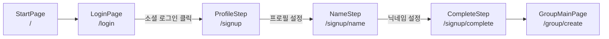
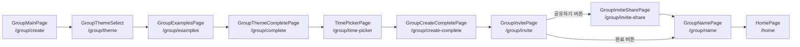
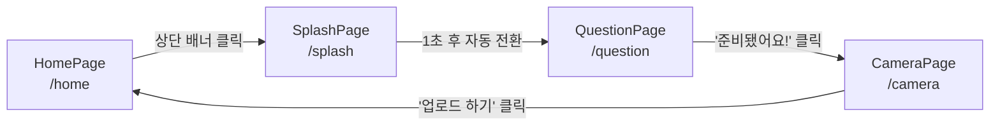

# V_O Web

## 📖 프로젝트 소개

> 목소리와 표정으로 남기는 우리만의 기록

**"매일 10초, 질문으로 열리는 우리들의 진짜 일상"**

V_O는 매일 던져지는 질문에 10초 영상으로 답하고, 소중한 사람들과 꾸밈없는 일상을 공유하는 클로즈드 영상 소통 서비스입니다.

1. **알림** - 매일 특정 시간, 그룹 성격에 맞는 오늘의 질문 도착
2. **촬영** - 질문 확인 후 10초간 무편집 답변 영상 촬영
3. **해제** - 업로드 즉시 블러 처리된 다른 멤버들의 영상 공개
4. **반응** - 이모지, 댓글로 서로의 일상에 가볍게 반응
5. **축적** - 영상이 나의 달력에 날짜별로 누적되어 추억 보관함이 됨

이러한 핵심 메커니즘을 통해 가공되지 않은 진짜 일상을 공유하려는 트렌드와 전시형 SNS 피로감 속에서, 소중한 사람들과 진정성 있게 소통할 수 있는 공간을 만들어보려 합니다.

## 👥 팀원 및 역할 분담

| 이름 | 닉네임 | 역할 |
|------|--------|------|
| [민선희](https://github.com/seonhi) | 시소 | 메인 피드 |
| [사석훈](https://github.com/sukhoon912) | 이브 | 로그인/회원가입 |
| [최서정](https://github.com/bum22) | 돌돌 | 촬영/나의 달력 |


## 🛠 기술 스택

| 분류 | 기술 |
|------|------|
| Framework | React, TypeScript |
| Build Tool | Vite |
| 상태 관리 | Zustand |
| HTTP 클라이언트 | Axios |
| 코드 컨벤션 | Biome |

## 📁 폴더 구조

```
src/
├── components/
│   ├── common/
│       ├── Button.tsx
│       ├── Input.tsx
│       ├── BottomNav.tsx
│       ├── VideoCard.tsx
│       ├── GroupTab.tsx
│       └── Timer.tsx
├── pages/
│   ├── AuthPage.tsx
│   ├── HomePage.tsx
│   └── CalendarPage.tsx
├── stores/
│   └── useStore.ts
├── api/
│   └── axios.ts
├── App.tsx
├── main.tsx
└── index.css
```

## 🌿 브랜치 전략
main ← dev ← feature/기능명

기능명은 닉네임#주차수 로 통일 (ex - feature/doldol#1)

| 브랜치 | 역할 |
|--------|------|
| main | 최종 배포 브랜치 |
| dev | 개발 통합 브랜치 |
| feature/기능명 | 기능 개발 브랜치 |

## 📝 커밋 컨벤션
| 타입 | 설명 |
|------|------|
| feat | 새 기능 개발 |
| fix | 버그 수정 |
| refactor | 코드 리팩토링 |
| style | 스타일 변경 |
| chore | 설정, 환경 세팅 |

## 🔀 PR 규칙
- feature → dev로 PR 올리기
- 최소 1명 이상 코드 리뷰 후 merge
- PR 템플릿 체크리스트 확인 후 제출

## 🐛 이슈 규칙
- 작업 전 반드시 이슈 생성
- 주차별 이슈에 체크리스트로 관리 (W1~W5)
- 작업 완료 후 해당 체크박스 체크

## 🚀 실행 방법

```bash
git clone https://github.com/V-O-dev/V_O_web.git
cd V_O_web
pnpm install
pnpm dev
```

## 📱 화면 목록 및 플로우

### 1) 온보딩 (시작 → 로그인 → 회원가입)



### 2) 그룹 생성



> 공유는 선택 사항이며, "완료" 버튼으로 공유 없이 바로 다음 단계로 넘어갈 수 있습니다.

### 3) 데일리 루틴 (알림 → 촬영 → 축적)



### 4) 메인 피드 내 이동

```mermaid
flowchart TD
    O["HomePage<br/>/home"] -->|하단 네비게이션| S["CalendarPage<br/>/calendar"]
    O -->|그룹 탭 클릭| T["GroupPage<br/>/group/:groupId"]
    O -->|프로필 클릭| U["EditNicknamePage<br/>/edit-nickname/:userId"]
    O -->|피드 영상 클릭| V
